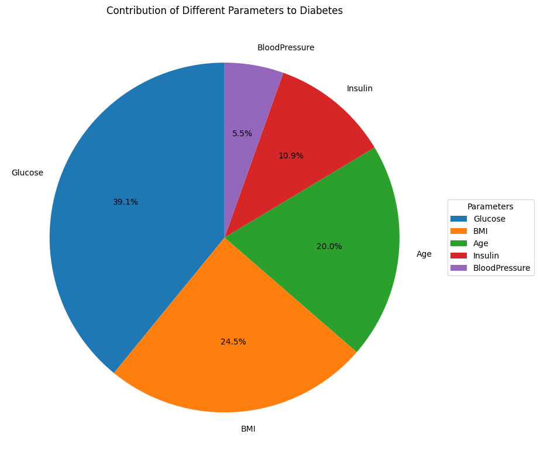

# Diabetes Data Visualization

A beginner-friendly project that analyzes diabetes patient health data and creates beautiful charts to understand which factors are linked to diabetes.

---

## What This Project Does

**In Simple Words:**
This tool looks at medical data from 768 patients and tries to understand:
- Which health measurements are connected to diabetes?
- How do factors like age, weight (BMI), blood sugar (glucose), etc. affect diabetes risk?
- What patterns can we find in the data?

The project creates various charts and graphs to make these patterns easy to see and understand.

---

## Quick Summary

| File | Purpose |
|------|---------|
| `main.py` | The main program that runs everything with one click |
| `source/data_loader.py` | Loads and prepares the diabetes data |
| `source/visualizer.py` | Creates all the charts and graphs |
| `source/analyzer.py` | Performs statistical calculations |
| `diabetes.csv` | The dataset with patient information |
| `requirements.txt` | Lists all required Python packages |
| `README.md` | Documentation |
| `.gitignore` | Tells git which files to ignore |

---

## Dataset Sample

The dataset contains information about 768 patients with these columns:

| Column | What It Means | Example |
|--------|---------------|---------|
| Pregnancies | How many times pregnant | 6 |
| Glucose | Blood sugar level (mg/dL) | 148 |
| BloodPressure | Blood pressure (mm Hg) | 72 |
| SkinThickness | Skin fold thickness (mm) | 35 |
| Insulin | Insulin level (mu U/ml) | 0 |
| BMI | Body mass index (kg/m²) | 33.6 |
| DiabetesPedigreeFunction | Genetic diabetes risk | 0.627 |
| Age | Age in years | 50 |
| Outcome | 0=No diabetes, 1=Has diabetes | 1 |

---

## Project Findings - Visualizations

### 1. Correlation Heatmap
This heatmap shows how all health factors relate to each other. Red means strong positive connection, blue means negative.


---

### 2. Feature Importance Pie Chart
This pie chart shows which health factors matter most when predicting diabetes. The larger the slice, the more important that factor is.



---

### 3. Diabetes Distribution Across Age Groups
This bar chart shows how many diabetic vs non-diabetic patients are in each age group. We can see diabetes rates increase with age.


---

### 4. Diabetes Distribution Across Blood Pressure Levels
This shows diabetes rates across different blood pressure ranges.


---

### 5. Diabetes Distribution Across BMI Levels
This shows diabetes rates across different BMI categories (underweight, normal, overweight, obese). Notice how higher BMI correlates with more diabetes.


---

### 6. Diabetes Distribution Across Glucose Levels
This is one of the most important charts! It shows that higher blood sugar levels strongly correlate with diabetes.


---

### 7. Diabetes Distribution Across Insulin Levels
This shows the relationship between insulin levels and diabetes occurrence.


---

## Key Findings Summary

### Correlation Rankings (Which factors matter most for diabetes)

| Rank | Factor | Correlation | What It Means |
|------|--------|-------------|---------------|
| 1 | **Glucose** | 0.47 | **Strongest link!** Higher blood sugar = more diabetes |
| 2 | **BMI** | 0.29 | Moderate link - Higher weight = more risk |
| 3 | **Age** | 0.24 | Moderate link - Older people have more diabetes |
| 4 | Pregnancies | 0.22 | Weak link |
| 5 | Insulin | 0.13 | Weak link |
| 6 | BloodPressure | 0.07 | Very weak link |

---

## How to Use

### Step 1: Set Up (One Time Setup)

```bash
# Create a virtual environment
python -m venv venv

# Activate it
.\venv\Scripts\activate

# Install required packages
pip install -r requirements.txt
```

### Step 2: Run the Program

```bash
python main.py
```

The program will:
1. Load the patient data
2. Analyze correlations between health factors
3. Compare diabetic vs non-diabetic patients
4. Generate charts and save them as PNG files

---

## What the Charts Tell Us

### From the Correlation Heatmap:
- **Glucose** has the strongest connection to diabetes
- **BMI** and **Age** also show significant correlations
- Some factors are correlated with each other (e.g., Age and Pregnancies)

### From the Pie Chart:
- Glucose accounts for the largest share of diabetes prediction
- BMI is the second most important factor
- Other factors contribute less individually

### From Age Distribution:
- Diabetes rates increase significantly after age 40
- Most diabetic patients are in the 40-60 age range
- Younger age groups have lower diabetes rates

### From BMI Distribution:
- Higher BMI categories have more diabetic patients
- Obese categories (BMI 30+) show highest diabetes rates
- Normal weight individuals have lowest diabetes rates

### From Glucose Distribution:
- Clear separation between diabetic and non-diabetic distributions
- Diabetic patients cluster in higher glucose ranges
- This is the clearest predictor of diabetes

---

## Project Structure

```
DiabetesDataViz/
├── main.py                    # Main program entry point
├── requirements.txt           # Python packages needed
├── README.md                  # This documentation
├── .gitignore                 # Files to ignore in git
│
├── source/                    # Source code folder
│   ├── __init__.py
│   ├── data_loader.py         # Data loading functions
│   ├── visualizer.py          # Chart creation functions
│   └── analyzer.py            # Analysis functions
│
├── notebooks/
│   └── Diabetes_Analysis_Workflow.ipynb  # Step-by-step guide
│
├── diabetes.csv               # Patient data
├── diabetes_ORG.csv           # Original data (backup)
│
└── *.png                      # Generated visualization charts
```

---

## For IDE Setup (VS Code, PyCharm, etc.)

### VS Code Settings
Create `.vscode/settings.json`:
```json
{
    "python.defaultInterpreterPath": "venv/Scripts/python.exe",
    "python.analysis.typeCheckingMode": "basic",
    "jupyter.ipykernelWidget": true
}
```

### PyCharm
1. Open the project folder
2. Go to File → Settings → Project → Python Interpreter
3. Click "Add" and select "Existing environment"
4. Browse to `venv\Scripts\python.exe`
5. Click OK

---

## Understanding the Analysis

### What is Correlation?
Correlation measures how strongly two things are related. For example:
- If taller people tend to be heavier, height and weight are positively correlated
- Values range from -1 (perfect negative) to +1 (perfect positive), with 0 meaning no relationship

### What Does This Mean for Diabetes?
- **Glucose (0.47)**: The strongest predictor. People with higher blood sugar are much more likely to have diabetes.
- **BMI (0.29)**: Moderate predictor. Higher body weight is associated with more diabetes.
- **Age (0.24)**: Older people have higher diabetes rates.

---

## Tips for Beginners

1. **Start with main.py** - This runs everything automatically
2. **Use Jupyter Notebook** - For interactive exploration, open `notebooks/Diabetes_Analysis_Workflow.ipynb`
3. **Look at the charts** - Visualizations make patterns easy to see
4. **Read the code comments** - Every function has detailed explanations

---

## Dependencies Explained

| Package | Why We Need It |
|---------|---------------|
| pandas | Handles data tables (like Excel) |
| numpy | Does math calculations |
| matplotlib | Creates basic charts |
| seaborn | Creates prettier charts |
| jupyter | Interactive notebook environment |

---

## Troubleshooting

### "Module not found" error
Make sure you activated the virtual environment and installed requirements:
```bash
.\venv\Scripts\activate
pip install -r requirements.txt
```

### "File not found" error
Make sure you're running from the project root folder where `diabetes.csv` is located.

---

## Next Steps to Learn More

1. Try modifying the code to analyze different features
2. Change chart colors and styles
3. Add your own data files
4. Create additional visualizations
5. Write your own analysis functions

---

## Credits

**Dataset**: [Pima Indians Diabetes Dataset](https://www.kaggle.com/datasets/uciml/pima-indians-diabetes-database)  
**Libraries**: pandas, matplotlib, seaborn, numpy


